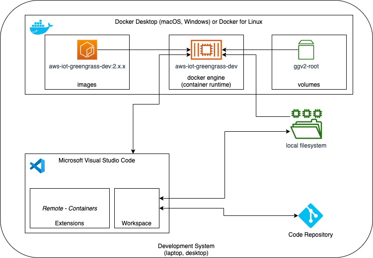
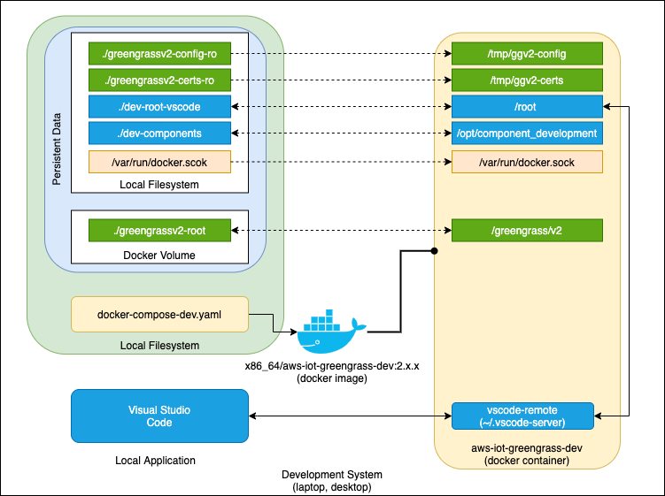
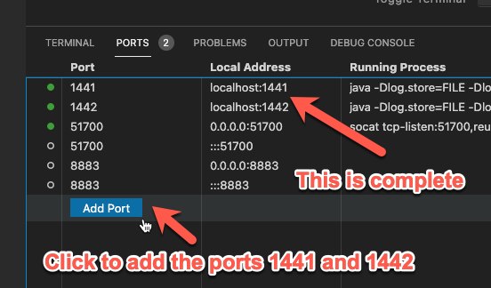
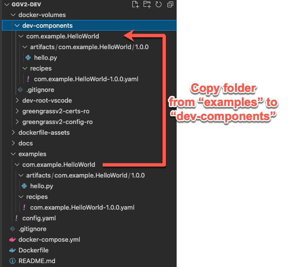
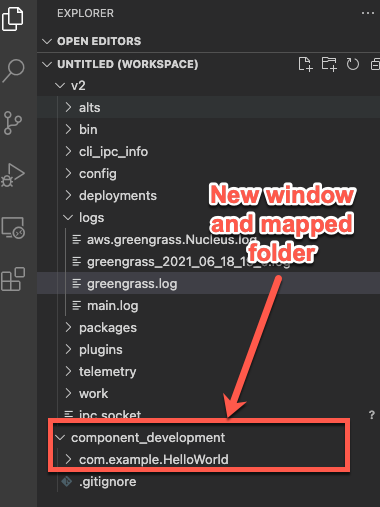

# AWS IoT Greengrass Development Using Docker

AWS IoT Greengrass (Greengrass) version 2 changes the way component development takes place by focusing on developing locally and then publishing components to the cloud. This approach is the opposite of Greengrass version 1 where edge logic was developed as AWS Lambda functions in the cloud and then deployed to local devices. This lengthened the development process by requiring code to be updated in the cloud Lambda resource, versioned, and then a new Greengrass deployment made before results could be seen.

With Greengrass version 2, code can be modified on-device, and then using a local command line interface (CLI) quickly deployed without any cloud intervention.

By tightly integrating a _local_ development approach with robust tools such as [Microsoft Visual Studio Code](https://code.visualstudio.com/) (VS Code or IDE) and [Docker Desktop](https://docs.docker.com/desktop/), you can develop components on your local laptop or desktop (development system) with these benefits:

- Rich Integrated Development Environment (IDE) with extensions to perform error checking, code completion, formatting, and compilation from a single application
- Quickly start and connect to Greengrass running as a docker container
- Develop offline without Internet access, or through advanced configurations simulate connected and disconnected states
- All component files including recipes and artifacts can be accessed within the Greengrass container _and_ from your development system allowing for management by code repositories
- VS Code extensions can run within the container environment to enhance the development experience

## Development Environment Overview

There are only three main requirements for local Greengrass development: Docker Desktop, Microsoft Visual Studio Code with the _Remote - Containers_ extension, and pre-created cloud resources for a Greengrass local device and deployment. All other requirements are installed during the setup process.

> **_NOTE:_** For setup you will require a connection to the Internet in order to download dependencies to build the Docker image and install VS Code extensions.

With Docker, you can:

1. Create the Greengrass Docker image from the `Dockerfile`
1. Start up and shutdown a Greengrass Docker container
1. Persist data locally between development sessions using docker volumes and directory-level mappings at the filesystem level
1. From VS Code, connect to the running container which will then install and run VS Code Server within the container

Once completed, your development system will look similar to this.



The development system can be integrated to other aspects of the overall development process.

As there is filesystem integration required between your development system and the Docker container, the Docker volume and file system mappings are important to understand for security testing and how to configure and operate Greengrass when running.



With the exception of the `greengrassv2-root` Docker volume, all other volume mappings reference local directories within this repository. These are empty to start with, but will be populated with different files either to initially configure Greengrass upon the initial launch, or to reflect development changes back to the development system (`docker-volumes/dev-components`). During the setup and operation steps, please refer to this diagram to understand the mappings.

## AWS Cloud and Greengrass Setup

Prior to the initial setup, make sure that you have created all the AWS IoT Core and AWS Identity and Access Management (IAM) resources needed for Greengrass. You can do this using the _base implementation_ process to create the AWS CloudFormation stack and the use the `config_docker.py` to download certificate and generate the `config.yaml` file.

> **Note:** All directory paths are relative to `v2/`

Copy the contents of `base/docker/volumes/certs` to `extras/local_dev/volumes/certs`. Also copy the contents of `base/docker/volumes/config` to `extras/local_dev/volumes/config`.

## Initial Setup

This initial setup covers creating and validating a single Greengrass development environment. See the _Advanced Configuration_ section for how to create and run multiple development environments locally.

1. Install pre-requisites (Docker Desktop, VS Code, and the VS Code _Remote - Containers_ extension) and ensure the [AWS Cloud Configuration](#aws-cloud-configuration) has been completed.
1. Copy the `local_dev` folder to a location off of your home directory, this may be needed due to limitations on the `docker.socket` file. For this walk-through `~/ggv2-dev` (`ggv2-dev` in the home directory) will be used.

   ```bash
   cd extras
   mv local_dev ~/ggv2-dev
   cd ~/ggv2-dev
   ```

1. (Optional) - You can remove the `.git` directory (`rm -rf ~/ggv2-dev/.git`) if you intend to use this code in another repository.
1. Either create a new VS Code workspace and add `ggv2-dev`, or if configured, run `code .` from the `ggv2-dev` directory.
1. Rename `docker-compose.yml.template` to `docker-compose.yml`, the modify the value for `AWS_REGION` to match the region in your `config.yaml` file.
1. Finally, from the terminal in the `ggv2-dev` directory, run `docker-compose build --no-cache`, which will create the local Greengrass Docker image with additional features used for development. This step will take at least two minutes to complete, and can be longer depending upon network connectivity and bandwidth.

### First Launch!

At this point, you will have a local environment ready for starting the Greengrass container. This is normally where configurations might need to be adjusted.

1. From the terminal, run `docker-compose up` and review the log files created. Greengrass will have started if you see the following lines:

   ```
   aws-iot-greengrass-dev  | + java -Dlog.store=FILE -Dlog.level= -Dlog.store=FILE -Droot=/greengrass/v2 -jar /greengrass/v2/alts/current/distro/lib/Greengrass.jar --setup-system-service false
   aws-iot-greengrass-dev  | Launching Nucleus...
   aws-iot-greengrass-dev  | Launched Nucleus successfully.
   ```

1. With the container running, in VS Code open the Command Palette (`SHIFT+CMD+P` for macOS, `SHIFT+CTRL+P` for Windows) and type **Attach to running**, which will filter to the _Remote-Containers: Attach to Running Container..._ command. Select this and hit **Enter**. This will show a drop-down of running containers, select the one named `/aws-iot-greengrass-dev`.

   This will open a new VS Code window which will go through the process of installing the VS Code Server. Once completed the VS Code environment will look similar to this:

   

1. Select the **Open folder** button and navigate to the `/greengrass/v2/` folder and select **OK**. This will refresh the window and show a new top-level folder named `V2`. From the _Explorer_ pane, open the file `logs/greengrass.log` and review the contents, looking for lines such as these below that indicate proper startup (normally near the end of the file):

   ```
   ...[INFO] (Thread-3) com.aws.greengrass.mqttclient.AwsIotMqttClient: Connecting to AWS IoT Core. {clientId=MyGreengrassCore}
   ...[INFO] (Thread-3) com.aws.greengrass.mqttclient.AwsIotMqttClient: Connection interrupted. {clientId=MyGreengrassCore}
   ...[INFO] (Thread-3) com.aws.greengrass.mqttclient.AwsIotMqttClient: Successfully connected to AWS IoT Core. {clientId=MyGreengrassCore, sessionPresent=false}
   ```

   > **_NOTE:_** Installing the [Log File Highlighter](https://marketplace.visualstudio.com/items?itemName=emilast.LogFileHighlighter) extension will syntax highlight the log files making them easier to read. You can install this within your normal VS Code environment on your laptop.

   If there are errors in the log file, determine what they are and resolve. Normally these will be related to some configuration error in `config.yaml`, or something not completed in the cloud.

   Once resolved, close the VS Code window in the container. From the terminal where the container is running, enter CTRL+C to exit and stop the Greengrass container, and then run the command `docker-compose down` to fully remove the docker resources. With the configuration corrected, run `docker-compose up` and reopen a new VS Code window and follow the steps above. Continue to repeat until there is a successful connection to AWS IoT Core.

   > **_NOTE:_** When you reopen the VS Code window, the previous folder and other settings should have been saved.

At this point, Greengrass is now running in a container, and you can open a VS Code window to interact directly with it. The normal workflow from this point would be:

1. `docker-compose up` to start the container in a local terminal
1. Open a VS Code window by attaching to the running container
1. **Development your component see [Locally Developing the First Component](#locally-developing-the-first-component) below**

When you are done developing, follow these steps to shutdown the container:

1. Save any work in the VS Code container window and close it
1. From the terminal, enter CTRL+C to stop Greengrass
1. From the terminal, run the command `docker-compose down` to release all network resources and prune the container

## First Greengrass Deployment From the Cloud

This section covers how to initiate a new or existing deployment to the running container. It does not cover the details of thing versus thing group deployments.

If this is brand new Greengrass core device, there are no deployments waiting for it from the cloud. To generate the first deployment, follow these steps:

1. From the AWS Console, create a new deployment and target either the core device (thing) or a thing group. Next, from the public component list, select the following, which will deploy the local development tools and the latest version of the Nucleus:

   - `aws.greengrass.Cli`
   - `aws.greengrass.LocalDebugConsole`
   - `aws.greengrass.Nucleus`

1. (Optional) To provide local web browser access to the debug console, on the _Configure components_ page, select the radio button for the _Local Debug Console_ and select **Configure component**. Enter the following into the _Configuration to merge_ section:

   ```json
   {
     "httpsEnabled": "false"
   }
   ```

   Then select **Confirm**. The `httpsEnabled` key will allow for non-HTTPS connections. If you don't update, an untrusted certificate will be presented. Depending upon your browser, follow instructions to allow for untrusted certificates for HTTPS _and_ websocket connections. Personally I set `httpsEnabled` to `false`.

1. Complete the rest of the deployment steps. If the Greengrass core device was targeted or it is a member of the thing group for the deployment, this will start the process. From the VS Code container window, monitor the status in the `logs/greengrass.log` file. After a few minutes, all the components should be downloaded, installed, and running. You should lines similar to this for a successful deployment (this was from a thing group deployment):

   ```
   ...[INFO] (pool-2-thread-11) com.aws.greengrass.deployment.IotJobsHelper: Updating status of persisted deployment. {Status=SUCCEEDED, StatusDetails={detailed-deployment-status=SUCCESSFUL}, ThingName=MyGreengrassCore, JobId=561cd1de-f347-4026-a5c4-348d78a65065}
   ...[INFO] (Thread-3) com.aws.greengrass.deployment.IotJobsHelper: Job status update was accepted. {Status=SUCCEEDED, ThingName=MyGreengrassCore, JobId=561cd1de-f347-4026-a5c4-348d78a65065}
   ...[INFO] (pool-2-thread-11) com.aws.greengrass.status.FleetStatusService: fss-status-update-published. Status update published to FSS. {serviceName=FleetStatusService, currentState=RUNNING}
   ...[INFO] (pool-2-thread-11) com.aws.greengrass.deployment.DeploymentDirectoryManager: Persist link to last deployment. {link=/greengrass/v2/deployments/previous-success}
   ...[INFO] (Thread-3) com.aws.greengrass.deployment.IotJobsHelper: Received empty jobs in notification . {ThingName=MyGreengrassCore}
   ```

1. The `greengrass-cli` executable is also installed. One step before connecting to the debug console is to locally port forward the ports needed (1441 and 1442). From the _VS Code container window_, select the _Ports_ tab and complete as follows:

   

   You can verify the debug console is running by getting the console debug password _from the VS Code container bash shell_:

   ```shell
   bash-4.2# /greengrass/v2/bin/greengrass-cli get-debug-password
   Jun 18, 2021 8:00:44 PM software.amazon.awssdk.eventstreamrpc.EventStreamRPCConnection$1 onConnectionSetup
   INFO: Socket connection /greengrass/v2/ipc.socket:8033 to server result [AWS_ERROR_SUCCESS]
   Jun 18, 2021 8:00:45 PM software.amazon.awssdk.eventstreamrpc.EventStreamRPCConnection$1 onProtocolMessage
   INFO: Connection established with event stream RPC server
   Username: debug
   Password: UvyqziSZHQ_SOME_RANDOM_STRING__2GWhBBGitZa4
   Password expires at: 2021-06-19T04:00:45.147943973Z
   ```

   Copy the value for `Password:`, then from the web browser on your local development system, open the URL: http://localhost:1441 and enter `debug` for _Username_ and the password for `Password`. This will connect to the local debug console and display a list of installed components.

That's it! You now have a running Greengrass container with public components deployed from the cloud. Relaunching the container via `docker-compose down` and then `docker-compose up` will still have these components installed and running.

> **_NOTE:_** Restarting Greengrass will reset the debug password. Use the `/greengrass/vs/bin/greengrass-cli get-debug-password` to obtain the current one after every start or if the password expires.

## Locally Developing the First Component

1. With Greengrass running, temporarily close the VS Code container window, leaving just the VS Code window to this repository. To demonstrate the development process, copy the directory `examples/com.example.HelloWorld` to `docker-volumes/dev-components`:

   

1. The _local host_ directory of `docker-volumes/dev-components` is mapped into the container as the directory `/opt/component_development`. Open a new VS Code container window (Attach to running container), and command pallette (CMD+SHIFT+P or CTRL+SHIFT+P) run the \*_Workspace: Add Folder to Workspace..._, then navigate and select `/opt/component_development`.
1. The window will refresh with the additional directory and look like this:

   

1. With this in place, the `greengrass-cli` can now be used to create a _local_ deployment of the component. From the bash shell in the VS Code container window, run the following command (specific to the example component):

   ```shell
   /greengrass/v2/bin/greengrass-cli  deployment create \
      --recipeDir /opt/component_development/com.example.HelloWorld/recipes \
      --artifactDir /opt/component_development/com.example.HelloWorld/artifacts \
      --merge "com.example.HelloWorld=1.0.0"
   ```

1. Review the logs directory for the creation and contents of the `com.example.HelloWorld.log`. Also, the Python code will write to the _work_ directory for the component, which is located at `/greengrass/v2/work/com.example.HelloWorld/Greengrass_HelloWorld.log`.

1. The local component can also be removed with the command (specific to the example component):

   ```shell
   /greengrass/v2/bin/greengrass-cli deployment create --remove "com.example.HelloWorld"
   ```

This is one approach to local development, deployment, and testing. The benefit is you can use the same component name and version number, which together make a component unique and immutable. The development approach would be:

1. While developing a component from the VS Code container window:
   1. Modify code within the `/opt/component_development` directory
   1. Use the `greengrass-cli` to deploy the component
   1. Review execution, log files, etc.
   1. Remove the component using the `greengrass-cli`
1. When coding is complete, the awscli can be used to package and publish the component to the cloud
1. Periodically commit the code from the VS Code window on the development machine from the `/docker-volumes/dev-components` directory.

Once changes have been made to the workspace such as adding directories above, these settings may or may not be saved between sessions. Please refer to the [container configuration files](https://code.visualstudio.com/docs/remote/attach-container#_attached-container-configuration-files) section of the VS Code documentation for configuration options.

## Getting Started Conclusion

That's it! You now have a local development environment for developing and testing with Greengrass version 2. With this you now have the ability to:

- Start and stop Greengrass in a repeatable and persistent manner
- Utilize VS Code to create code with any preferred extensions for code autocompletion, linting, etc.
- Extend the local development environment to include other useful packages and commands

## Cleanup

To remove a development environment, follow these steps:

1. Completely shutdown the docker container via `docker-compose down`
1. Remove the Docker volume persisted for the Greengrass root directory (`/greengrass/v2`):

   ```shell
   $ docker volume list
   DRIVER    VOLUME NAME
   local     2afe63256db6b33175d8520d9617bed648ec7612a78e7fe79a8e35b4e1279dbc
   local     4e6c8d6105a5aeaa4ecc6f4a69209d29e19ebd0da3b181fde95f017df126d422
   local     6d1c883f4cdd20018d21844913b4383596e3aa26cf1ba3b3e0d6f5cde8e8522c
   local     09ab124ea9b0c0c82fe252f8c5506b939e3d3b5c13f30eea7ce4c398447b499b
   local     31e9b2765c06e5e96eeb1718a81ebe5139d56ebccee8f4f739c9cc56feb8655c
   local     152e2795d2417e6352907b89faec34a4dfffc38b51c7b3029aca36acde67de40
   local     da9d37fa56df9a68aca14d4994e0f54365ccbbf8c33b6f7bd1213554112d19bd
   local     e38e2fab6ebbd3d8baea8bafe3b8aea5431e8b5aee822135dce101b97e458759
   local     ggv2-dev_greengrassv2-root
   $ docker volume rm ggv2-dev_greengrassv2-root
   ```

1. If space is required, remove the Docker image:

   ```shell
   $ docker image list
   REPOSITORY                                     TAG                  IMAGE ID       CREATED         SIZE
   x86_64/aws-iot-greengrass-dev                  2.4.0                a143c9b2aefb   5 hours ago     1.31GB
   $ docker image rm x86_64/aws-iot-greengrass-dev:2.4.0
   ```

1. Save the initial configuration file and certificates if needed from `docker-volumes/greengrassv2-certs-ro` and `docker-volumes/greengrassv2-config-ro`
1. Ensure code in `docker-volumes/dev-components` has been saved outside the directory
1. If deployed from the _base implementation_, delete the CloudFormation stack
1. Delete the repository `ggv2-dev`
1. If the cloud resources are not needed, delete the AWS IoT thing, certificate, AWS IoT policy, and AWS IoT role alias (and associated IAM role)

## FAQ

##### I've created a new Greengrass environment but the the `/greengrass/v2` is from an older setup.

This approach uses a Docker data volume for `/greengrass/v2`. With Greengrass shutdown, run the command `docker volume list`, look for a volume name containing "greengrassv2-root". Delete the volume and then start the Greengrass container which will crete a new volume with the same name.
